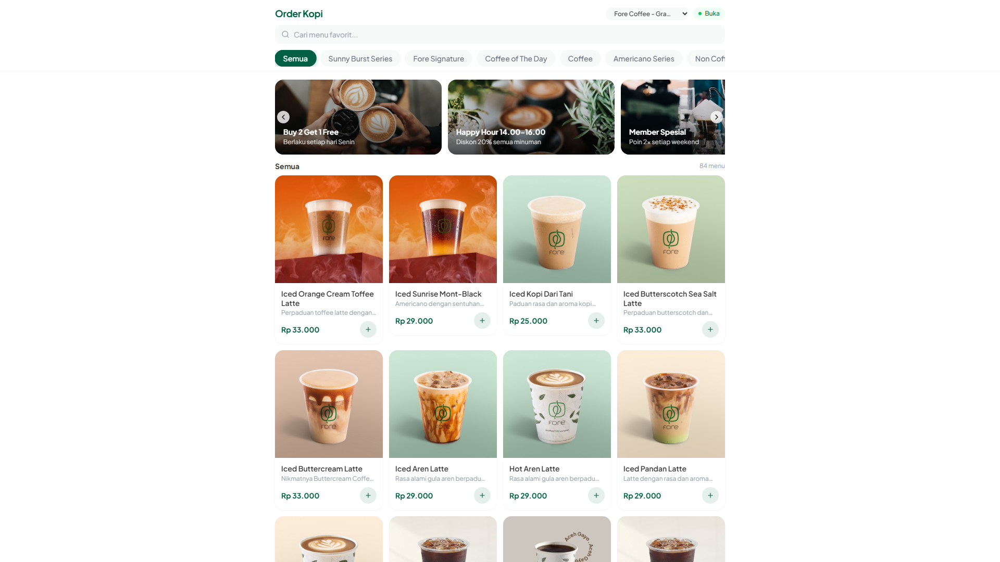
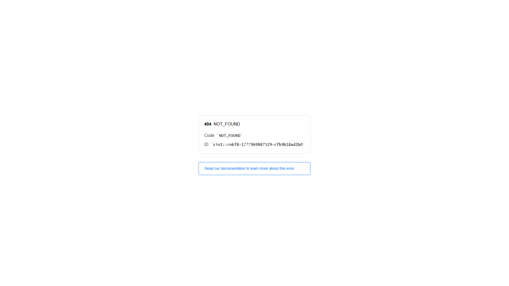
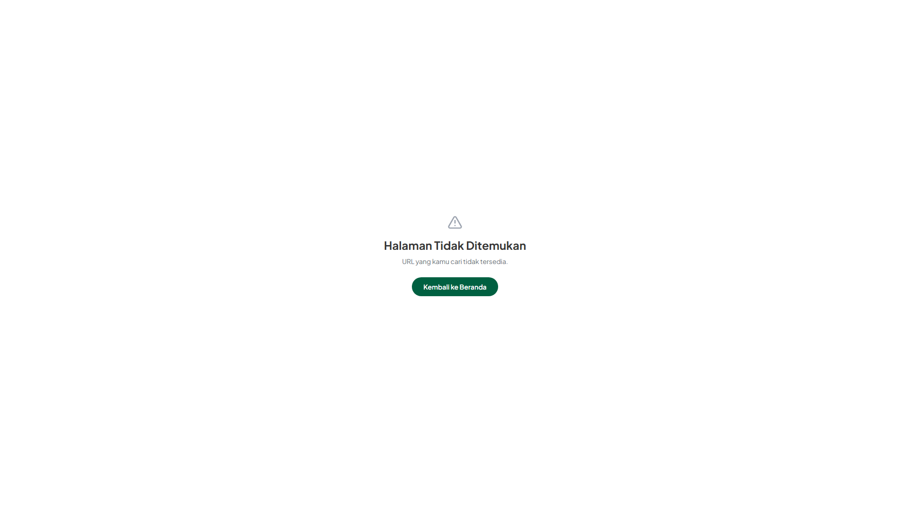

# Order Kopi

**Aplikasi pemesanan kopi online untuk coffee shop — siap pakai, mudah dikustomisasi.**

[](https://react.dev)
[](https://vite.dev)
[](https://tailwindcss.com)
[](https://supabase.com)

---

## 📸 Screenshots

### Customer Interface
| Menu & Keranjang | Order Status | Rating & Review |
|------------------|--------------|-----------------|
|  |  |  |
| Browse menu dengan kategori, search, dan filter | Track pesanan real-time dengan estimasi waktu | Berikan rating dan review setelah pesanan selesai |

### Admin Dashboard
| Dashboard | Kelola Menu | Laporan Penjualan |
|-----------|-------------|-------------------|
|  |  |  |
| Monitor pesanan real-time dengan filter status | CRUD produk, kategori, dan upload foto | Analisis penjualan harian dengan grafik |

### Payment Flow
| QRIS Static + Unique Code | Upload Payment Proof | Payment Confirmed |
|---------------------------|---------------------|-------------------|
|  |  |  |
| Scan QRIS & pay exact amount (Rp 50,123) | Upload screenshot as proof | Order confirmed after verification |

---

## ✨ Highlight

- 🚀 **Production-Ready** — Security hardening, RLS, rate limiting, audit trail
- 💰 **Zero Transaction Fees** — QRIS Static + unique code (save Rp 24M/year)
- 🤖 **Auto-Verification** — 80%+ orders auto-approved
- 📱 **Mobile-First** — PWA support, responsive, touch-friendly
- 🔒 **Enterprise Security** — HMAC webhook, fraud detection, session tokens
- 🎫 **Voucher System** — BOGO, Fixed Rp, Percentage discount
- 📊 **Sales Analytics** — Laporan harian, grafik per jam, top items
- 💸 **Gratis untuk Mulai** — Supabase free tier + Vercel/Netlify hosting

---

## 🏆 vs Kompetitor

| Fitur | Order Kopi | Kompetitor A | Kompetitor B |
|-------|:----------:|:------------:|:------------:|
| Biaya Setup | **Gratis** | $99/bln | $49/bln |
| QRIS + Unique Code | ✅ | ❌ | ✅ Via Midtrans |
| Auto-Verification | ✅ 80%+ | ❌ Manual | ✅ Webhook |
| Open Source | ✅ MIT | ❌ | ❌ |
| Self-Hosted | ✅ | ❌ | ❌ |

Lihat perbandingan lengkap di → [docs/FEATURES.md](docs/FEATURES.md)

---

## 🚀 Quick Start

```bash
git clone <repo-url>
cd order-kopi
npm install
```

Setup database + admin + env vars → [docs/SETUP.md](docs/SETUP.md)

```bash
npm run dev
```

---

## 📚 Dokumentasi

| File | Isi |
|------|-----|
| [docs/CLIENT_SETUP.md](docs/CLIENT_SETUP.md) | 🆕 Panduan setup lengkap untuk client baru |
| [docs/FEATURES.md](docs/FEATURES.md) | Fitur lengkap, use cases, perbandingan kompetitor |
| [docs/SETUP.md](docs/SETUP.md) | Panduan setup developer (database, admin user, env vars) |
| [docs/DEPLOYMENT.md](docs/DEPLOYMENT.md) | Deploy ke Netlify, edge functions, environment variables |
| [docs/SECURITY.md](docs/SECURITY.md) | Keamanan, privacy, error monitoring |
| [docs/PAYMENT.md](docs/PAYMENT.md) | QRIS payment system, unique code, auto-verification |
| [docs/VOUCHER.md](docs/VOUCHER.md) | Sistem voucher (BOGO, Fixed, Percentage) |
| [docs/TROUBLESHOOTING.md](docs/TROUBLESHOOTING.md) | Solusi masalah umum |
| [docs/CUSTOMIZATION.md](docs/CUSTOMIZATION.md) | Kustomisasi (warna, font, menu, Telegram notifikasi) |

---

## 📊 Tech Stack

| Layer | Teknologi |
|-------|-----------|
| Frontend | React 19, Vite 8, Tailwind CSS 4 |
| Backend | Supabase (PostgreSQL, Auth, Realtime, Storage, Edge Functions) |
| Payment | QRIS Static + Unique Code (zero fees) |
| Icons | Lucide React |
| Hosting | Netlify / Vercel |

---

## Demo

**Live Demo:** [https://order-kopi-app.netlify.app](https://order-kopi-app.netlify.app)

---

## Lisensi

MIT License — bebas digunakan untuk keperluan komersial maupun personal.
